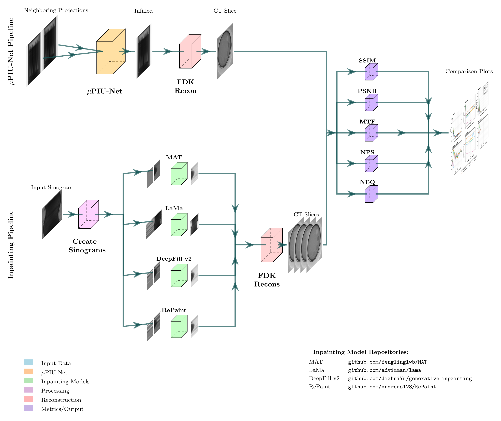

# muPIU-Net: Micro-CT Projection Infilling U-Net

[](https://opensource.org/licenses/MIT)

A deep learning framework for projection infilling in micro-CT imaging - recovering missing CT projections to enable undersampled scanning with reduced radiation dose.

## Overview

This repository contains the code for our paper on CT sinogram infilling using deep learning. The framework implements two main approaches:

1. **muPIU-Net (U-Net)** - Custom U-Net architecture for direct projection interpolation in the sinogram domain
2. **Base Model Comparison** - Four state-of-the-art image inpainting models (LaMa, MAT, DeepFill v2, RePaint) adapted for CT sinogram inpainting

Both approaches use FDK reconstruction for fair comparison, followed by quantitative image quality metrics (MTF, NPS, NEQ).



## Repository Structure

```
muPIU-Net/
├── ct_core/                    # Core library package
│   ├── vff_io.py               # VFF file I/O
│   ├── calibration.py          # HU calibration
│   ├── field_correction.py     # Bright/dark field correction
│   └── paths.py                # Centralized path configuration
│
├── unet_pipeline/              # U-Net inference pipeline
│   ├── model.py                # U-Net architecture
│   ├── infer.py                # Inference script
│   └── run_all.py              # Full reconstruction pipeline
│
├── reconstruction/             # FDK reconstruction
│   └── fdk.py                  # GPU-accelerated FDK
│
├── metric_calculators/         # Image quality metrics
│   ├── mtf_calculator.py       # Modulation Transfer Function
│   ├── nps_calculator.py       # Noise Power Spectrum
│   ├── neq_calculator.py       # Noise Equivalent Quanta
│   └── helper_scripts/         # Comparison plotting
│
├── base_models/                # Base model comparison framework
│   ├── models/
│   │   ├── lama/               # LaMa (Large Mask Inpainting)
│   │   ├── mat/                # MAT (Mask-Aware Transformer)
│   │   ├── deepfill/           # DeepFill v2
│   │   └── repaint/            # RePaint (Diffusion-based)
│   └── shared/
│       └── utils/              # Shared utilities
│
└── data/                       # Data directories (not tracked)
    ├── scans/                  # Raw projection data
    ├── results/                # Processed results
    └── models/                 # Trained model checkpoints
```

## Installation

See [INSTALLATION.md](INSTALLATION.md) for detailed setup instructions.

### Quick Start

```bash
# Clone with submodules
git clone --recursive https://github.com/UBC-Ford-lab/muPIU-Net-microCT-sinogram-infilling-network.git
cd muPIU-Net-microCT-sinogram-infilling-network

# Create virtual environment
python -m venv venv
source venv/bin/activate  # Linux/Mac
# or: venv\Scripts\activate  # Windows

# Install dependencies
pip install -r requirements.txt

# Verify installation
python -c "from ct_core import vff_io"
```

## Usage
### U-Net Inference

Generate predictions for missing projections (every 2nd projection):

```bash
python unet_pipeline/infer.py \
    --scan_folder /path/to/scan \
    --checkpoint data/models/mupiu-net_final_model.pth \
    --output_dir data/results/unet_output
# Output: Complete projection set with predicted projections

# Run FDK reconstruction on infilled projections
python reconstruction/fdk.py
```

**Input:** Folder containing VFF projection files (same format as base models)
**Output:** Complete projection set with originals + predicted projections (`*_pred.vff`)

### Reconstruction

Run FDK reconstructions to compare ground truth, undersampled, and U-Net infilled projections:

```bash
python unet_pipeline/run_all.py \
    --scan_folder /path/to/scan \
    --unet_folder data/results/unet_output \
    --mode all
```

**CLI Arguments:**

| Argument | Required | Description |
|----------|----------|-------------|
| `--scan_folder` | Yes | Original scan folder with all projections, bright/dark fields, and `scan.xml` |
| `--unet_folder` | Only for `unet` mode | Output folder from `infer.py` containing U-Net predictions |
| `--output_dir` | No | Base output directory (default: `data/results`) |
| `--mode` | No | Reconstruction mode: `gt`, `under`, `unet`, or `all` (default: `all`) |

**Reconstruction Modes:**

| Mode | Description |
|------|-------------|
| `gt` | Ground truth reconstruction using all projections |
| `under` | Undersampled reconstruction using every 2nd projection |
| `unet` | Reconstruction using U-Net infilled projections |
| `all` | Run all three reconstructions sequentially |

**Examples:**

```bash
# Run all reconstructions
python unet_pipeline/run_all.py \
    --scan_folder /path/to/scan \
    --unet_folder data/results/unet_output

# Run only ground truth reconstruction
python unet_pipeline/run_all.py \
    --scan_folder /path/to/scan \
    --mode gt

# Run only U-Net reconstruction (requires unet_folder)
python unet_pipeline/run_all.py \
    --scan_folder /path/to/scan \
    --unet_folder data/results/unet_output \
    --mode unet
```

 **Output:** Reconstructions are saved to `data/results/` as:                                                                          
 - `{scan_name}_gt_recon.vff` - Ground truth                                                                                           
 - `{scan_name}_under_recon.vff` - Undersampled                                                                                        
 - `{scan_name}_unet_recon.vff` - U-Net infilled 

### Base Model Comparison

All base models require creating a sinogram dataset from .vff scan files first.

**Input Data:** Place your scan folder containing VFF files anywhere on your system. You'll pass the path via `--scan_folder`. The folder should contain:
- `Projections.vff` - Raw projection data
- `BrightField.vff` - Bright field calibration
- `DarkField.vff` - Dark field calibration
- `scan.xml` - Detector data

```bash
# Step 0: Create sinogram dataset from .vff files (required for all models)
python base_models/shared/utils/create_sinogram_dataset.py \
    --scan_folder /path/to/scan \
    --output_dir base_models/shared/sinogram_dataset
# Output: base_models/shared/sinogram_dataset/
#         ├── sinograms_lama/    (masked sinograms for LaMa)
#         ├── sinograms_gt/      (ground truth sinograms)
#         ├── masks/             (binary masks)
#         └── metadata.json      (scan geometry info)
```

#### LaMa (Full Resolution - No Tiling)

LaMa processes full-resolution sinograms (410×3500) directly without tiling:

```bash
# 1. Run LaMa inference
python base_models/models/lama/scripts/run_inference.py
# Output: base_models/models/lama/data/sinograms_infilled/
#         └── sino_XXXX_mask001.png (infilled sinograms)

# 2. Reconstruct
python base_models/models/lama/scripts/reconstruct.py \
    --scan_folder /path/to/scan
# Output: base_models/models/lama/results/reconstructed_volume/
#         └── volume.vff (reconstructed CT volume)
```

#### MAT, DeepFill, RePaint (Tiled Workflow)

These models use 256×256 tiles and require an additional tiling step:

```bash
# 1. Create tiles from sinogram dataset
python base_models/shared/utils/create_tiles.py \
    --input_dir base_models/shared/sinogram_dataset \
    --output_dir base_models/shared/sinogram_tiles
# Output: base_models/shared/sinogram_tiles/
#         ├── sinograms_gt/         (256x256 GT tiles for reference)
#         ├── sinograms_masked/     (256x256 masked tiles - model input)
#         ├── masks/                (256x256 mask tiles)
#         └── tiling_metadata.json  (metadata for tile merging)
```

**MAT:**
```bash
python base_models/models/mat/scripts/run_inference.py
# Output: base_models/models/mat/data/tiles_infilled/

python base_models/models/mat/scripts/merge_tiles.py
# Output: base_models/models/mat/data/sinograms_infilled/

python base_models/models/mat/scripts/reconstruct.py --scan_folder /path/to/scan
# Output: base_models/models/mat/results/reconstructed_volume/
```

**DeepFill:**
```bash
python base_models/models/deepfill/scripts/run_inference.py
# Output: base_models/models/deepfill/data/tiles_infilled/

python base_models/models/deepfill/scripts/merge_tiles.py
# Output: base_models/models/deepfill/data/sinograms_infilled/

python base_models/models/deepfill/scripts/reconstruct.py --scan_folder /path/to/scan
# Output: base_models/models/deepfill/results/reconstructed_volume/
```

**RePaint:**
```bash
cd base_models/models/repaint/RePaint
python ../scripts/run_inference.py --conf_path ../configs/ct_sinogram.yml
# Output: base_models/models/repaint/data/tiles_infilled/

python base_models/models/repaint/scripts/merge_tiles.py
# Output: base_models/models/repaint/data/sinograms_infilled/

python base_models/models/repaint/scripts/reconstruct.py --scan_folder /path/to/scan
# Output: base_models/models/repaint/results/reconstructed_volume/
```

### Metric Calculation

Calculate MTF, NPS, and NEQ metrics for each model's reconstruction:

```bash
# DeepFill v2
python base_models/models/deepfill/scripts/calculate_metrics.py \
  --gt_recon data/results/ground_truth_reconstruction.vff \
  --unet_recon data/results/unet_reconstruction.vff
# Output: base_models/models/deepfill/metrics/

# RePaint (similar for mat, lama)
python base_models/models/repaint/scripts/calculate_metrics.py \
  --gt_recon data/results/ground_truth_reconstruction.vff \
  --unet_recon data/results/unet_reconstruction.vff
# Output: base_models/models/repaint/metrics/
```

### Comparison Plots

Generate comparison figures across all models:

**MTF/NPS/NEQ Comparison:**
```bash
python metric_calculators/helper_scripts/all_models_comparison_plot.py \
    --scan_name Scan_1681 \
    --results_dir data/results \
    --output_dir ./figures
# Output: all_models_MTF_NPS_NEQ_comparison.{png,pdf,eps}
```

**Visual Slice Comparison:**
```bash
python metric_calculators/helper_scripts/plot_reconstruction_comparison.py \
    --scan_name Scan_1681 \
    --slice_idx 150 \
    --output_dir ./figures
# Output: all_models_reconstruction_comparison.{png,pdf,eps}
#         all_models_reconstruction_comparison_with_labels.{png,pdf,eps}
```

**CLI Arguments (both scripts):**

| Argument | Default | Description |
|----------|---------|-------------|
| `--scan_name` | `Scan_1681` | Scan name prefix for reconstruction files |
| `--results_dir` | `data/results` | Directory containing GT/Under/U-Net reconstructions |
| `--output_dir` | Script location | Output directory for figures |
| `--slice_idx` | `150` | (plot_reconstruction only) Slice index to display |

**Required Input Files:**
- `data/results/{scan_name}_gt_recon.vff` - Ground truth reconstruction
- `data/results/{scan_name}_under_recon.vff` - Undersampled reconstruction
- `data/results/{scan_name}_unet_recon.vff` - U-Net reconstruction
- `base_models/models/{lama,mat,deepfill,repaint}/results/reconstructed_volume.vff` - Base model reconstructions

## Citation

If you use this code in your research, please cite:

```bibtex
@article{2026mupiunet,
  title={TBD},
  author={TBD},
  journal={TBD},
  year={2026}
}
```

See [CITATION.cff](CITATION.cff) for the full citation.

## License

This project is licensed under the MIT License - see the [LICENSE](LICENSE) file for details.

## Acknowledgments

This work was conducted at the UBC Ford Lab and is supported by a grant from the BC Lung Foundation. We thank the developers of the following open-source projects:

- [LaMa](https://github.com/advimman/lama) - Large Mask Inpainting
- [MAT](https://github.com/fenglinglwb/MAT) - Mask-Aware Transformer
- [DeepFill v2](https://github.com/JiahuiYu/generative_inpainting) - Generative Inpainting
- [RePaint](https://github.com/andreas128/RePaint) - Diffusion-based Inpainting
