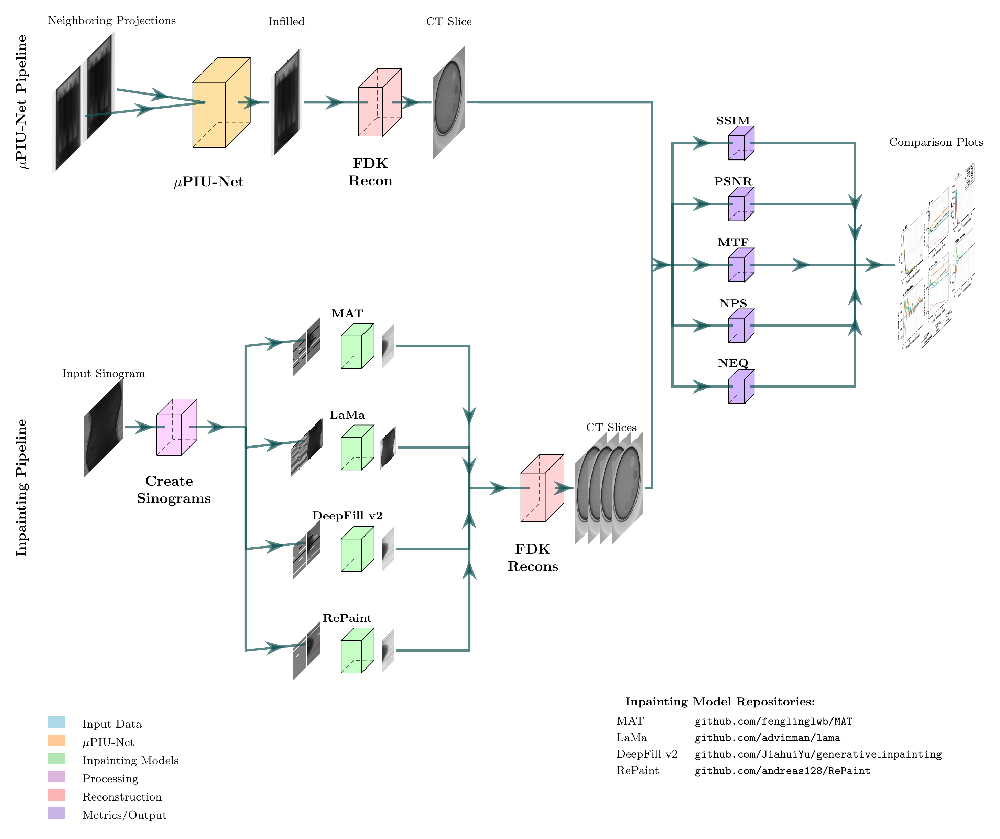

# µPIU-Net: Micro-CT Projection Infilling U-Net

[](https://opensource.org/licenses/MIT)
[](https://doi.org/10.5281/zenodo.18519787)

A deep learning framework for projection infilling in micro-CT imaging - recovering missing CT projections to enable undersampled scanning with reduced radiation dose.

## Overview

This repository contains the code for our paper on CT sinogram infilling using deep learning. The framework implements two main approaches:

1. **µPIU-Net** - Custom U-Net architecture for direct projection interpolation in the sinogram domain
2. **Base Model Comparison** - Four state-of-the-art image inpainting models (LaMa, MAT, DeepFill v2, RePaint) adapted for CT sinogram inpainting

Both approaches use FDK reconstruction for fair comparison, followed by quantitative image quality metrics (MTF, NPS, NEQ).



## Data & Trained Model Weights

The trained µPIU-Net model weights and the evaluation dataset (mCTP 610 phantom) are publicly available on Zenodo:

**[https://zenodo.org/records/18519787](https://zenodo.org/records/18519787)** (DOI: [10.5281/zenodo.18519787](https://doi.org/10.5281/zenodo.18519787))

Download and place the model checkpoint into `data/models/` for inference.

## Repository Structure

```
µPIU-Net/
├── paths.py                    # Centralized path configuration
│
├── reconstruction/             # FDK reconstruction (git submodule)
│   ├── fdk.py                  # GPU-accelerated FDK
│   ├── run_fdk_recon.py         # CLI reconstruction script
│   └── ct_core/                # Core CT utilities
│       ├── vff_io.py           # VFF file I/O
│       ├── calibration.py      # HU calibration
│       └── tiff_converter.py   # TIFF export
│
├── unet_pipeline/              # µPIU-Net inference pipeline
│   ├── model.py                # µPIU-Net architecture
│   ├── infer.py                # Inference script
│   └── domain_comparison.py    # Multi-domain evaluation (SSIM/PSNR)
│
├── metric_calculators/         # Image quality metrics (git submodule)
│   ├── mtf_calculator.py       # Modulation Transfer Function
│   ├── nps_calculator.py       # Noise Power Spectrum
│   ├── neq_calculator.py       # Noise Equivalent Quanta
│   ├── ttf_calculator.py       # Task Transfer Function
│   ├── d_prime_calculator.py   # Detectability Index (d')
│   └── helper_scripts/         # Comparison plotting
│
├── base_models/                # Base model comparison framework
│   ├── models/
│   │   ├── lama/               # LaMa (Large Mask Inpainting)
│   │   ├── mat/                # MAT (Mask-Aware Transformer)
│   │   ├── deepfill/           # DeepFill v2
│   │   └── repaint/            # RePaint (Diffusion-based)
│   └── shared/
│       └── utils/
│           ├── create_sinogram_dataset.py  # VFF → 2D sinograms
│           └── create_tiles.py             # Sinograms → 256×256 tiles
│
└── data/                       # Data directories (not tracked)
    ├── scans/                  # Raw projection data
    ├── results/                # Processed results
    └── models/                 # Trained model checkpoints
```

## Installation

See [INSTALLATION.md](INSTALLATION.md) for detailed setup instructions.

### Quick Start

```bash
# Clone with submodules (includes reconstruction and metric_calculators packages)
git clone --recursive https://github.com/UBC-Ford-lab/muPIU-Net-microCT-sinogram-infilling-network.git
cd muPIU-Net-microCT-sinogram-infilling-network

# If you already cloned without --recursive, init submodules:
# git submodule update --init --recursive

# Create virtual environment
python -m venv venv
source venv/bin/activate  # Linux/Mac
# or: venv\Scripts\activate  # Windows

# Install package and dependencies
pip install -e .

# Verify installation
python -c "from reconstruction.ct_core import vff_io; from metric_calculators import mtf_calculator; print('OK')"
```

## Usage

### Input Data

Each scan folder should contain:
- `acq-XX-XXXX.vff` — Individual projection files (one per angle)
- `bright.vff` — Bright field calibration
- `dark.vff` — Dark field calibration
- `scan.xml` — Scanner geometry (source/detector positions, spacing)

### µPIU-Net Infilling + Reconstruction

**Step 1 — Run µPIU-Net inference** to predict missing projections:

```bash
python unet_pipeline/infer.py \
    --scan_folder data/scans/Scan_1681 \
    --outdir data/results
```

This produces two output folders:
- `data/results/Scan_1681_with_pred/` — originals + predicted projections (for infilled reconstruction)
- `data/results/Scan_1681_no_pred/` — originals only (for undersampled baseline reconstruction)

Two inference modes are available via `--mode`:
- `interleave` (default) — predicts between every consecutive pair, doubling the projection count
- `subsample` — treats odd-indexed projections as missing and predicts them from even neighbors

**Step 2 — Reconstruct** each projection set with FDK:

```bash
# Ground truth (all original projections)
python -m reconstruction.run_fdk_recon data/scans/Scan_1681

# µPIU-Net infilled projections
python -m reconstruction.run_fdk_recon data/results/Scan_1681_with_pred

# Undersampled baseline (originals only, no infilling)
python -m reconstruction.run_fdk_recon data/results/Scan_1681_no_pred
```

The reconstructor auto-detects the original scan folder (for calibration fields) from the `Scan_XXXX` naming convention. Override with `--scan-folder` if needed. The total angular coverage is determined automatically from `scan.xml` (`IncrementAngle × ViewCount`); override with `--total-angle` if needed.

**Output:** Calibrated HU volumes saved alongside the input folder as `{folder}_recon.vff`.

**Optional: bilateral filter post-processing** — apply edge-preserving denoising after HU calibration:

```bash
python -m reconstruction.run_fdk_recon data/results/Scan_1681_with_pred \
    --bilateral-filter \
    --bilateral-sigma-spatial 1.5 \
    --bilateral-sigma-range 50.0
```

This applies a slice-by-slice bilateral filter (OpenCV) that reduces noise while preserving tissue boundaries. Output is saved as `{folder}_recon_bilateral.vff` to keep the unfiltered volume intact. The spatial sigma (mm) controls the smoothing neighbourhood and the range sigma (HU) controls the edge-preservation threshold.

See `python -m reconstruction.run_fdk_recon --help` for all options (filter type, voxel size, FOV, bilateral filter).

### Base Model Comparison

All base models require creating a sinogram dataset from the scan folder first.

```bash
# Step 0: Create sinogram dataset from .vff files (required for all models)
python base_models/shared/utils/create_sinogram_dataset.py \
    --scan_folder /path/to/scan \
    --output_dir base_models/shared/sinogram_dataset
# Output: base_models/shared/sinogram_dataset/
#         ├── sinograms_lama/    (masked sinograms for LaMa)
#         ├── sinograms_gt/      (ground truth sinograms)
#         ├── masks/             (binary masks)
#         └── metadata.json      (scan geometry info)
```

#### LaMa (Full Resolution - No Tiling)

LaMa processes full-resolution sinograms (410×3500) directly without tiling:

```bash
# 1. Run LaMa inference
python base_models/models/lama/scripts/run_inference.py
# Output: base_models/models/lama/data/sinograms_infilled/
#         └── sino_XXXX_mask001.png (infilled sinograms)

# 2. Reconstruct
python base_models/models/lama/scripts/reconstruct.py \
    --scan_folder /path/to/scan
# Output: base_models/models/lama/results/reconstructed_volume/
#         └── volume.vff (reconstructed CT volume)
```

#### MAT, DeepFill, RePaint (Tiled Workflow)

These models use 256×256 tiles and require an additional tiling step:

```bash
# 1. Create tiles from sinogram dataset
python base_models/shared/utils/create_tiles.py \
    --input_dir base_models/shared/sinogram_dataset \
    --output_dir base_models/shared/sinogram_tiles
# Output: base_models/shared/sinogram_tiles/
#         ├── sinograms_gt/         (256x256 GT tiles for reference)
#         ├── sinograms_masked/     (256x256 masked tiles - model input)
#         ├── masks/                (256x256 mask tiles)
#         └── tiling_metadata.json  (metadata for tile merging)
```

**MAT:**
```bash
python base_models/models/mat/scripts/run_inference.py
# Output: base_models/models/mat/data/tiles_infilled/

python base_models/models/mat/scripts/merge_tiles.py
# Output: base_models/models/mat/data/sinograms_infilled/

python base_models/models/mat/scripts/reconstruct.py --scan_folder /path/to/scan
# Output: base_models/models/mat/results/reconstructed_volume/
```

**DeepFill:**
```bash
python base_models/models/deepfill/scripts/run_inference.py
# Output: base_models/models/deepfill/data/tiles_infilled/

python base_models/models/deepfill/scripts/merge_tiles.py
# Output: base_models/models/deepfill/data/sinograms_infilled/

python base_models/models/deepfill/scripts/reconstruct.py --scan_folder /path/to/scan
# Output: base_models/models/deepfill/results/reconstructed_volume/
```

**RePaint:**
```bash
cd base_models/models/repaint/RePaint
python ../scripts/run_inference.py --conf_path ../configs/ct_sinogram.yml
# Output: base_models/models/repaint/data/tiles_infilled/

python base_models/models/repaint/scripts/merge_tiles.py
# Output: base_models/models/repaint/data/sinograms_infilled/

python base_models/models/repaint/scripts/reconstruct.py --scan_folder /path/to/scan
# Output: base_models/models/repaint/results/reconstructed_volume/
```

### Metric Calculation

The `metric_calculators/` submodule provides CLI tools and a Python API for computing image quality metrics (MTF, NPS, NEQ, TTF, d') on reconstructed volumes. See the [metric_calculators README](metric_calculators/README.md) for full documentation.

**Per-model metrics** (run from each base model's scripts directory):

```bash
python base_models/models/deepfill/scripts/calculate_metrics.py \
  --gt_recon data/results/ground_truth_reconstruction.vff \
  --unet_recon data/results/mupiunet_reconstruction.vff
```

**Cross-model comparison plots:**

```bash
# MTF/NPS/NEQ comparison across all models
python -m metric_calculators.helper_scripts.all_models_comparison_plot \
    --scan_name Scan_1681 --output_dir ./figures

# Visual slice comparison
python -m metric_calculators.helper_scripts.plot_reconstruction_comparison \
    --scan_name Scan_1681 --slice_idx 150 --output_dir ./figures
```

## Citation

If you use this code in your research, please cite:

```bibtex
@article{2026mupiunet,
  title={TBD},
  author={TBD},
  journal={TBD},
  year={2026}
}
```

See [CITATION.cff](CITATION.cff) for the full citation.

## License

This project is licensed under the MIT License - see the [LICENSE](LICENSE) file for details.

## Acknowledgments

This work was conducted at the UBC Ford Lab and is supported by a grant from the BC Lung Foundation. We thank the developers of the following open-source projects:

- [LaMa](https://github.com/advimman/lama) - Large Mask Inpainting
- [MAT](https://github.com/fenglinglwb/MAT) - Mask-Aware Transformer
- [DeepFill v2](https://github.com/JiahuiYu/generative_inpainting) - Generative Inpainting
- [RePaint](https://github.com/andreas128/RePaint) - Diffusion-based Inpainting
